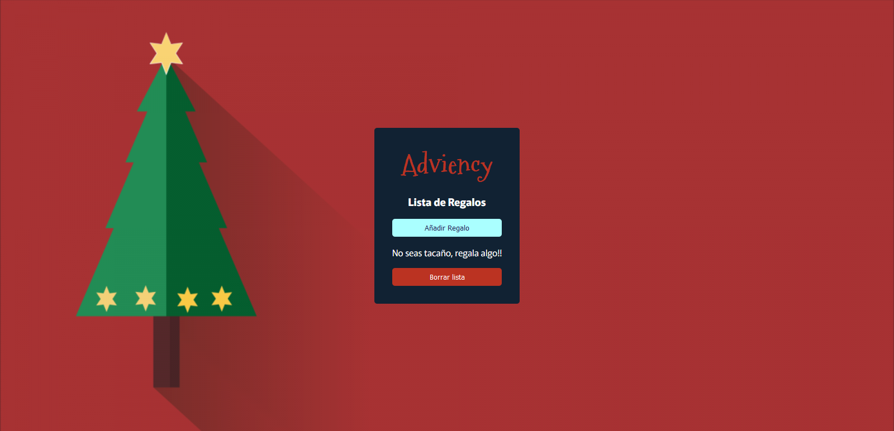
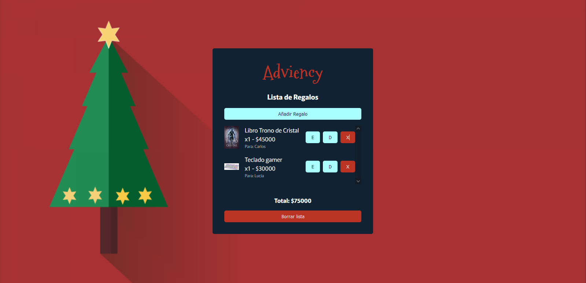
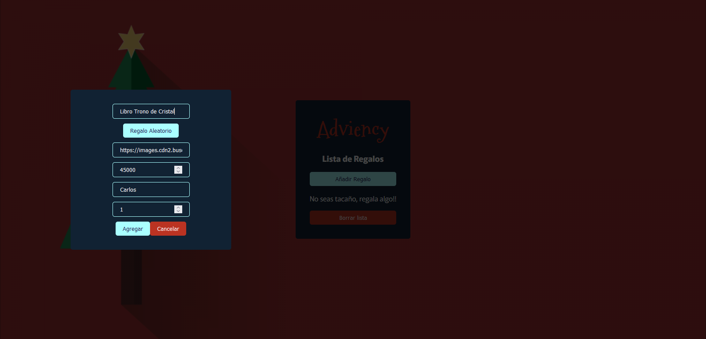

# Proyecto Adviency

Es un proyecto de práctica propuesto por [@goncy](https://twitter.com/carandev)en el cual día a día se propone un ejercicio para que la aplicación vaya escalando, aquí está el [tweet](https://twitter.com/goncy/status/1597581725382721538?s=20) donde él explica día a día.

En mi caso usé [React JS](https://reactjs.org/) y fué mi primer contacto con este gran framework usando también el localstorage.

Estos fueron algunos de los problemas que resolví durante el desarrollo:

- La distribución de la información en cada regalo.
- Hacer los formularios en modales sin frameworks.
- Manejar la información que reciben los formularios al editar y duplicar.

A continuación dejo todas las secciones que tiene la aplicación:

<h3 align="center">Listado de regalos 🎁</h3>

<h3 align="center">Formulario de añadir regalos, editar y duplicar ✔</h3>

